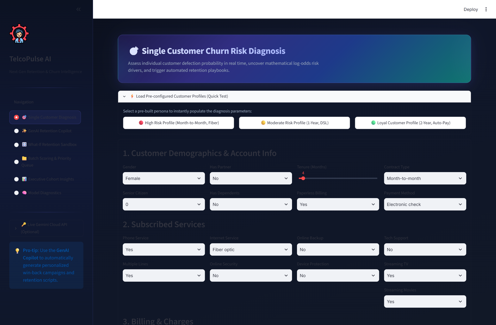
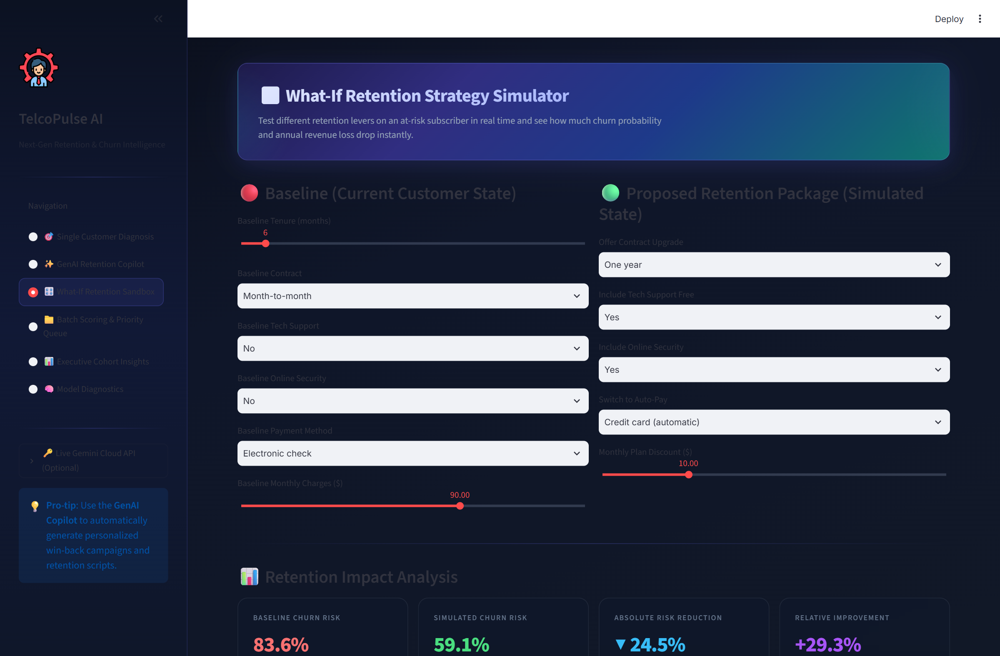
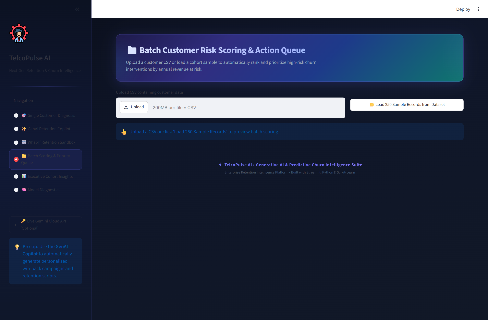
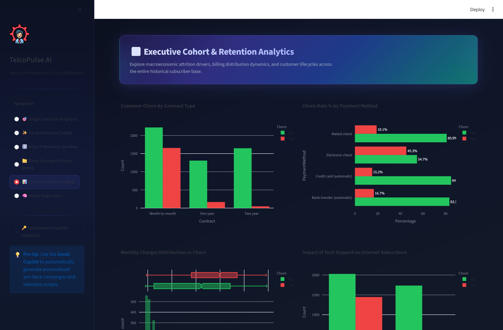
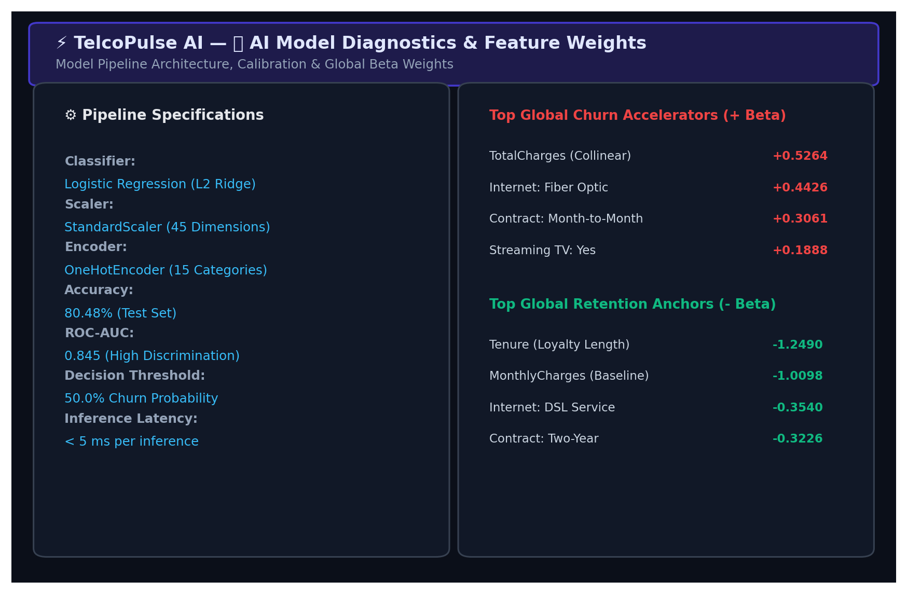

# ⚡ TelcoPulse AI: Telecom Customer Churn & Retention Intelligence Suite

[](https://telecomcustomers.streamlit.app/)
[](https://www.python.org/downloads/)
[](https://scikit-learn.org/)
[](https://opensource.org/licenses/MIT)

> 🚀 **Live Interactive Demo:** [https://telecomcustomers.streamlit.app/](https://telecomcustomers.streamlit.app/)

**TelcoPulse AI** is an enterprise-grade AI decision support system designed for telecom customer retention teams. Going beyond basic churn probability predictions, TelcoPulse provides **real-time local risk explainability**, **prescriptive action playbooks**, **interactive "What-If" contract simulations**, **cohort-level batch prioritization**, **GenAI retention campaign synthesis**, and a **persistent database management layer (MySQL / SQLite)**.

---

## 🌟 Key Features

### 1. 🎯 Individual Customer Churn Diagnosis & Explainability
- **Real-Time Risk Gauge**: Visual speedometer mapping churn risk into actionable tiers (*Safe <30%*, *Moderate 30-60%*, *Critical >60%*).
- **Local Feature Attribution (Log-Odds Decomposition)**: Diverging waterfall bars showing the top drivers increasing vs protecting against churn for every specific customer.
- **Financial Risk Exposure**: Automatically calculates **Estimated Annual Revenue at Risk ($/yr)**.
- **Prescriptive Retention Playbook**: Generates targeted business actions (e.g., contract extension incentives, auto-pay discounts, free tech support trials).
- **1-Click Profile Presets**: Quickly load High Risk, Moderate, or Loyal customer personas.
- **Persistent Database Save**: Save assessment directly to the persistent database with one click.

### 2. ✨ GenAI Customer Retention Copilot
- Harness Generative AI to generate personalized win-back emails, frontline customer service negotiation scripts, and CRM-ready retention campaigns.
- Log campaigns and track lifecycle statuses (*Draft*, *Dispatched*, *Retained*, *Churned*).

### 3. 🎛️ What-If Retention Strategy Simulator
- Interactive sandbox allowing retention specialists to test retention packages (contract extensions, bundling security/support, fee discounts).
- Live recalculation showing **Absolute Risk Reduction (▼ %)** and **Relative Improvement (+%)** before making an offer to the customer.

### 4. 📁 Batch Cohort Scoring & Prioritized Action Queue
- Upload any customer `.csv` or load a sample cohort.
- Scores all accounts simultaneously and ranks them by **Expected Annual Loss**.
- Multi-criteria filtering by Risk Tier and Contract type.
- 1-click export of prioritized outreach campaign lists (`.csv`) and bulk database persistence.

### 5. 📊 Executive Cohort Insights & Macro EDA
- Interactive Plotly visualizations for macro patterns:
  - Churn rates across Contract Types & Payment Methods.
  - Monthly charge density distribution vs churn status.
  - Value-added services (Tech Support, Online Security) impact analysis.

### 6. 🗄️ Database & Customer CRM Explorer (MySQL / SQLite)
- **Dual Engine Architecture**: Native support for **XAMPP MySQL** (port 3306) with automatic, zero-config **SQLite fallback**.
- **Customer Predictions Persistence**: Saves individual and batch customer diagnoses with timestamps, probability, risk tier, and feature driver explanations.
- **GenAI Retention Campaign Tracker**: Logs generated personalized retention copy, concession matrices, promo codes, and lifecycle statuses.
- **Direct SQL Query Sandbox**: Execute custom analytical queries (`SELECT`, `GROUP BY`, aggregations) with instant DataFrame rendering and CSV export.
- **1-Click Seeding**: Auto-populate the database directly from the raw telecom dataset with ML scoring.

### 7. 🧠 Model Diagnostics & Transparency
- Complete visibility into ML pipeline architecture, data scalers, one-hot encoders, and global beta coefficients.

---

## 📸 Screenshots

| 1. Single Customer Diagnosis & Playbook | 2. What-If Retention Sandbox |
|:---:|:---:|
|  |  |

| 3. Batch Scoring & Priority Queue | 4. Executive Cohort Analytics |
|:---:|:---:|
|  |  |

| 5. AI Model Diagnostics |
|:---:|
|  |

---

## 🗄️ Database Configuration (XAMPP MySQL & SQLite)

The platform supports both **XAMPP MySQL** and **SQLite** seamlessly:

1. **Using XAMPP MySQL**:
   - Open **XAMPP Control Panel** and start the **MySQL** module.
   - In the Streamlit app, navigate to **"🗄️ Database & CRM Records" -> "⚙️ Connection & Settings"**.
   - Default credentials (`host: localhost`, `port: 3306`, `user: root`, `password: `).
   - Click **"Test Connection"** and **"Save Settings"**. The database `telecom_churn` and tables are created automatically!

2. **Using SQLite (Zero-Setup Fallback)**:
   - If MySQL is not running or if preferred, the app automatically persists data into `telecom_churn.db` locally.

---

## 🚀 Quickstart Guide

### Prerequisites
- Python 3.10 or higher
- Git
- XAMPP (optional, for MySQL)

### Installation

1. **Clone the repository:**
   ```bash
   git clone <YOUR_REPO_URL>
   cd "Telecom customer churn"
   ```

2. **Create a virtual environment (optional but recommended):**
   ```bash
   python -m venv venv
   # On Windows:
   venv\Scripts\activate
   # On macOS/Linux:
   source venv/bin/activate
   ```

3. **Install dependencies:**
   ```bash
   pip install -r requirements.txt
   ```

4. **Launch the Streamlit App:**
   ```bash
   streamlit run app.py
   ```
   *Open [http://localhost:8501](http://localhost:8501) in your browser.*

---

## 🛠️ Tech Stack
- **Framework**: [Streamlit](https://streamlit.io/)
- **Database**: [MySQL](https://www.mysql.com/) (via PyMySQL / SQLAlchemy) & [SQLite](https://www.sqlite.org/)
- **Machine Learning**: [Scikit-Learn](https://scikit-learn.org/), [Joblib](https://joblib.readthedocs.io/)
- **Data Manipulation**: [Pandas](https://pandas.pydata.org/), [NumPy](https://numpy.org/)
- **Visualizations**: [Plotly](https://plotly.com/python/)

---

## 📄 License
This project is licensed under the MIT License.
